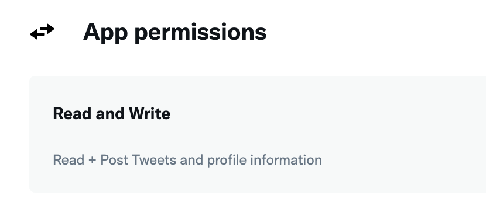

# Exchange.art Sales Bot
## Posts to Twitter and/or Discord

Ensure that you have the correct versions of node
```console
node -v
# v16.13.1
```

Clone the repository and install the dependencies via NPM
```console
git clone https://github.com/0XABSTRACT/Exchange-Art-Sales-Bot
cd Exchange-Art-Sales-Bot/
npm install
```

## Setup Twitter API
In order to access the Twitter API you'll have to register for a developer account. You can do this at

[https://developer.twitter.com/en/docs/developer-portal/overview](https://developer.twitter.com/en/docs/developer-portal/overview)

Initialize an application using your Twitter developer portal. You'll need access to the v1 Twitter API, you can apply for elevated access via the developer portal

[https://developer.twitter.com/en/portal/dashboard](https://developer.twitter.com/en/portal/dashboard)


 You'll need Read and Write access for your application via your Twitter Dev Portal


