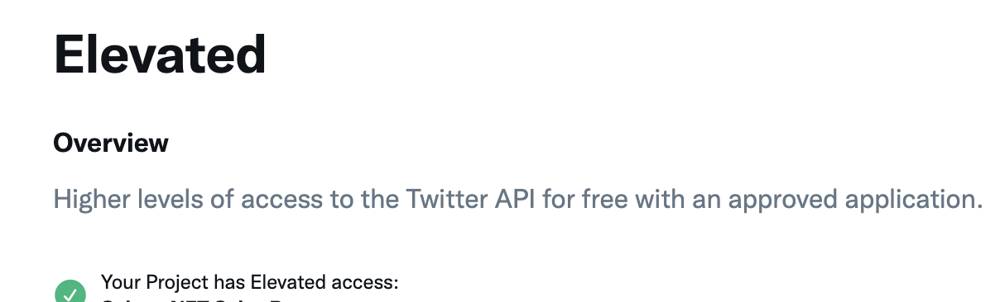

# Exchange.art Sales Bot
This is a sales bot which tracks sales for a given NFT collection on [exchange.art](https://exchange.art/). This bot has Twitter and/or Discord API integration. It can be configured to Tweet recent sales data and/or post the data to a specified Discord channel.

## Initial Setup & Install
Ensure that you have the correct versions of node
```console
node -v
# v16.13.1
```

Clone the repository and install the dependencies via NPM
```console
git clone https://github.com/0XABSTRACT/Exchange-Art-Sales-Bot
cd Exchange-Art-Sales-Bot/
npm install
```

### Create a .env file to hold onto constants & Twitter/Discord API access keys
Take a look at the Exchange-Art-Sales-Bot/tempenv text file, it looks like this :

```text
COLLECTION_URL=YOUR_COLLECTION_URL
TWITTER_API_KEY=YOUR_API_KEY
TWITTER_API_KEY_SECRET=YOUR_API_KEY_SECRET
TWITTER_ACCESS_TOKEN=YOUR_ACCESS_TOKEN
TWITTER_ACCESS_TOKEN_SECRET=YOUR_ACCESS_TOKEN_SECRET
DISCORD_TOKEN=YOUR_DISCORD_TOKEN
DISCORD_CHANNEL_ID=YOUR_DISCORD_CHANNEL_ID
```

### Create a new hidden file called Exchange-Art-Sales-Bot/.env

This new .env file will follow the same format as the tempenv file but it will contain all of your unique constants, API keys, and tokens for request access.

The .env file also contains a link to the Exchange.art NFT collection url. Set the line containing COLLECTION_URL to the collection's url you wish to track.


```text
COLLECTION_URL=https://exchange.art/collections/GAIKOTSU%20DEMONS
...
```

## Setup Twitter API
### We need to setup a developer account and proper permissions to get our TWITTER_API_KEY, TWITTER_API_KEY_SECRET, TWITTER_ACCESS_TOKEN, TWITTER_ACCESS_TOKEN_SECRET, and to send requests
In order to access the Twitter API you'll have to register for a developer account. You can do this at

[https://developer.twitter.com/en/docs/developer-portal/overview](https://developer.twitter.com/en/docs/developer-portal/overview)

Initialize an application using your Twitter developer portal. You'll need access to the v1 Twitter API, you can apply for elevated access via the developer portal

[https://developer.twitter.com/en/portal/dashboard](https://developer.twitter.com/en/portal/dashboard)



 You'll need Read and Write access for your application via your Twitter Dev Portal


Finally we'll access the Keys & Tokens tab for our App via the Twitter developer portal and update our .env file to contain our unique keys & tokens.


And update the .env file to contain our unique keys and tokens

```text
...
TWITTER_API_KEY=YOUR_API_KEY
TWITTER_API_KEY_SECRET=YOUR_API_KEY_SECRET
TWITTER_ACCESS_TOKEN=YOUR_ACCESS_TOKEN
TWITTER_ACCESS_TOKEN_SECRET=YOUR_ACCESS_TOKEN_SECRET
...
```


## Setup Discord API

Start by registering as a Discord developer and initializing an App via the Discord Developer Portal

[https://discord.com/developers/docs/intro](https://discord.com/developers/docs/intro)

Next you're going to have to create a Discord bot via the Developer Portal

[https://discordpy.readthedocs.io/en/stable/discord.html](https://discordpy.readthedocs.io/en/stable/discord.html)


We have to invite the bot to the server in which we wish to post, to do this you'll have to build the invitation URL using your Discord app's client_id and the proper permissions. This bot needs permission to post messages to a specified channel so we'll need permission 2048

[https://discordjs.guide/preparations/adding-your-bot-to-servers.html#bot-invite-links](https://discordjs.guide/preparations/adding-your-bot-to-servers.html#bot-invite-links)

The server invitation link for your bot looks something like this :

```text
https://discord.com/api/oauth2/authorize?client_id=MY_CLIENT_ID&&permissions=2048&scope=bot%20applications.commands
```

Next we need to update the .env file to reflect our uniquely assigned DISCORD_TOKEN and the particular DISCORD_CHANNEL_ID to specify which channel the bot will post recent sales data into.


```text
DISCORD_TOKEN=YOUR_DISCORD_TOKEN
DISCORD_CHANNEL_ID=YOUR_DISCORD_CHANNEL_ID
```
